# Meridian Architecture

AI-powered CX triage, resolution, and intelligence system for Reap's Zendesk support organisation.

> **Legend:** Solid borders = built (Phase 1). Dashed borders = planned (Phases 2–6).

```mermaid
graph TB
    %% ── External Systems ──────────────────────────────────────────────────
    subgraph EXT ["External Systems"]
        ZD["🎫 Zendesk\n(tickets + Help Center)"]
        ANT["🤖 Anthropic API\nclaude-opus / claude-haiku"]
        OAI["🤖 OpenAI API\ngpt-4o (fallback)"]
        STORES["📱 Review Platforms\nApp Store · Google Play · Trustpilot"]
    end

    %% ── CI / CD ────────────────────────────────────────────────────────────
    subgraph CICD ["CI/CD (GitHub Actions)"]
        GHA["eval.yml\nTriggers on prompts/** changes"]
        PROMPTS["prompts/\nclassification/v1\nresponse-generation/v1\nevaluation/judge\nsystem/classification"]
        DATASETS["datasets/golden/\nclassification-v1.jsonl"]
    end

    %% ── AWS Infrastructure (CDK-managed) ───────────────────────────────────
    subgraph AWS ["AWS  ·  CDK-managed  (beacon-{env}-*)"]

        subgraph INGEST ["Event Ingestion  [Phase 2]"]
            WH[/"Zendesk Webhook\nListener Lambda"/]
            EB[("EventBridge\nCustom Bus")]
            SQS[["SQS\nTickets Queue\n(vis: 300s, 7d retention)"]]
            DLQ[["SQS DLQ\n+ CloudWatch Alarm\n(threshold: 10 msgs)"]]
        end

        subgraph COMPUTE ["Lambda Functions"]
            EVAL["⚙ Eval Lambda\n(accuracy ≥ 85% gate)\n[Phase 1 ✓]"]
            CLASSIFY[/"Classification Lambda\ncategory · priority · sentiment\nlanguage · compliance · crypto tags\n[Phase 2]"/]
            RESP[/"Response Gen Lambda\nKB-grounded drafts\n[Phase 3]"/]
            KB_L[/"KB Ingestion Lambda\nHelp Center → pgvector\n[Phase 3]"/]
            RUNBOOK_L[/"Runbook Lambda\npayment lookup · card freeze\nescalation · resend notification\n[Phase 5]"/]
            VOC_L[/"VoC Ingestion Lambda\nApp Store · Google Play\nTrustpilot · 6–12h cadence\n[Phase 6]"/]
        end

        subgraph STORAGE ["Storage"]
            AURORA[("Aurora Serverless v2\nPostgreSQL 16 + pgvector\n0.5–4 ACU · encrypted\n[Phase 1 ✓]")]
            DDB_AUDIT[("DynamoDB\naudit-log\npk: AUDIT#hash | sk: timestamp\nTTL 90d\n[Phase 1 ✓]")]
            DDB_IDEM[("DynamoDB\nidempotency\nWebhook deduplication\n[Phase 1 ✓]")]
            S3[("S3 Assets Bucket\nVersioned · encrypted\n[Phase 1 ✓]")]
        end

    end

    %% ── ZAF Sidebar (Zendesk App Framework) ────────────────────────────────
    subgraph ZAF ["ZAF Sidebar Copilot  [Phase 4]"]
        P1["Panel 1 · Customer Context\naccount · payment status · risk signals"]
        P2["Panel 2 · Meridian Intelligence\nclassification · compliance flags\ndraft response · KB references"]
        P3["Panel 3 · Runbook Actions\npayment lookup · card freeze\nescalate · one-click send"]
    end

    %% ── Monorepo Shared Packages ────────────────────────────────────────────
    subgraph CORE ["@beacon/core  (packages/core)  [Phase 1 ✓]"]
        LLM["llm/invoke()\n3× retry · exp backoff\nZod validation · cost tracking\nAnthropic + OpenAI"]
        CB["circuit-breaker/\nDynamoDB-backed\nCLOSED → OPEN → HALF_OPEN\n5 failures · 60s window"]
    end

    %% ── Data Flow ──────────────────────────────────────────────────────────

    %% Ingestion
    ZD -->|"ticket.created webhook"| EB
    EB --> SQS
    SQS -->|"trigger"| CLASSIFY
    SQS -.->|"after 3 retries"| DLQ
    STORES -->|"scheduled scrape"| VOC_L

    %% Classification & Knowledge Base
    CLASSIFY -->|"dedup check"| DDB_IDEM
    CLASSIFY -->|"query similar tickets"| AURORA
    CLASSIFY -->|"LLM call"| LLM
    KB_L -->|"embed + upsert"| AURORA
    KB_L -->|"raw files"| S3
    ZD -->|"Help Center articles"| KB_L

    %% Response Generation
    RESP -->|"semantic search"| AURORA
    RESP -->|"LLM call"| LLM

    %% Runbook
    RUNBOOK_L -->|"API actions"| ZD

    %% LLM layer
    LLM -->|"messages.create"| ANT
    LLM -->|"chat.completions"| OAI
    LLM -->|"check OPEN?"| CB
    LLM -->|"write audit entry"| DDB_AUDIT
    CB -->|"state read/write"| DDB_AUDIT

    %% ZAF Sidebar
    P1 & P2 -->|"read classification + KB"| AURORA
    P1 & P2 -->|"read audit trail"| DDB_AUDIT
    P3 -->|"trigger"| RUNBOOK_L
    P2 -->|"one-click send"| ZD

    %% Eval pipeline
    GHA -->|"pnpm eval"| EVAL
    PROMPTS --> GHA
    DATASETS -->|"golden JSONL"| EVAL
    EVAL -->|"LLM call (claude-haiku)"| LLM
    EVAL -->|"write results"| DDB_AUDIT

    %% Styling
    classDef built fill:#1a3a1a,stroke:#4caf50,color:#e8f5e9
    classDef planned fill:#1a1a3a,stroke:#7986cb,color:#e8eaf6,stroke-dasharray:5 5
    classDef external fill:#2a1a0a,stroke:#ff9800,color:#fff3e0
    classDef storage fill:#1a2a3a,stroke:#29b6f6,color:#e1f5fe

    class EVAL,LLM,CB,AURORA,DDB_AUDIT,DDB_IDEM,S3 built
    class WH,EB,SQS,DLQ,CLASSIFY,RESP,KB_L,RUNBOOK_L,VOC_L,P1,P2,P3 planned
    class ZD,ANT,OAI,STORES external
    class AURORA,DDB_AUDIT,DDB_IDEM,S3 storage
```



---

## Monorepo Structure

```
beacon/                         # pnpm workspace · turborepo
├── packages/
│   └── core/                     # @beacon/core — shared by all lambdas
│       ├── llm/invoke.ts         # LLM abstraction: retry, Zod validation, cost audit
│       ├── circuit-breaker/      # DynamoDB-backed circuit breaker
│       ├── types/                # Ticket, LLMOptions, AuditLogEntry, CBState
│       └── schemas/              # Shared Zod schemas
├── lambdas/
│   ├── eval/                     # Eval CLI + Lambda (pnpm eval --prompt --dataset)
│   ├── classifier/               # [Phase 2] Ticket classification
│   ├── responder/                # [Phase 3] Draft response generation
│   ├── kb-ingestion/             # [Phase 3] Help Center → pgvector
│   ├── runbook/                  # [Phase 5] Internal API actions
│   └── voc-ingestion/            # [Phase 6] Review platform scraping
├── infra/                        # AWS CDK — DispatchStack
├── prompts/                      # Versioned prompt files (YAML frontmatter + body)
│   ├── classification/v1.md
│   ├── response-generation/v1.md
│   ├── evaluation/judge.md
│   └── system/classification.md
├── datasets/
│   └── golden/                   # JSONL golden datasets for eval
└── .github/workflows/eval.yml    # CI: run eval on prompts/** changes
```

## AWS Resources (DispatchStack)

| Resource | Type | Purpose |
|----------|------|---------|
| `beacon-{env}-tickets-queue` | SQS | Buffers inbound Zendesk ticket events |
| `beacon-{env}-tickets-dlq` | SQS + CW Alarm | Dead-letter queue; alarm at depth > 10 |
| `beacon-{env}-audit-log` | DynamoDB | LLM calls, runbook executions, routing decisions, circuit breaker state |
| `beacon-{env}-idempotency` | DynamoDB | Webhook deduplication keys (TTL-backed) |
| `beacon-{env}-assets-{acct}` | S3 | KB source documents, attachments |
| `beacon-{env}-event-bus` | EventBridge | Custom event bus for ticket events |
| `beacon-{env}-db` | Aurora Serverless v2 | PostgreSQL 16 + pgvector (0.5–4 ACU) |
| `beacon-{env}-eval` | Lambda | Prompt accuracy eval gate (CI-triggered) |
| `beacon-lambda-{env}` | IAM Role | Execution role for all Lambda functions |

## LLM Model Tiering

| Task | Model | Rationale |
|------|-------|-----------|
| Classification, response draft | `claude-opus-4-5` | Complex, high-stakes |
| Eval runner, intent detection | `claude-haiku-3-5` | High-volume, latency-sensitive |
| OpenAI fallback | `gpt-4o` | Circuit breaker open on Anthropic |

## Circuit Breaker

Protects external service calls (Anthropic, OpenAI, Zendesk API) using a DynamoDB-backed state machine shared across all Lambda instances:

```
CLOSED ──(5 failures)──► OPEN ──(60s)──► HALF_OPEN ──(success)──► CLOSED
                                                     └──(failure)──► OPEN
```
